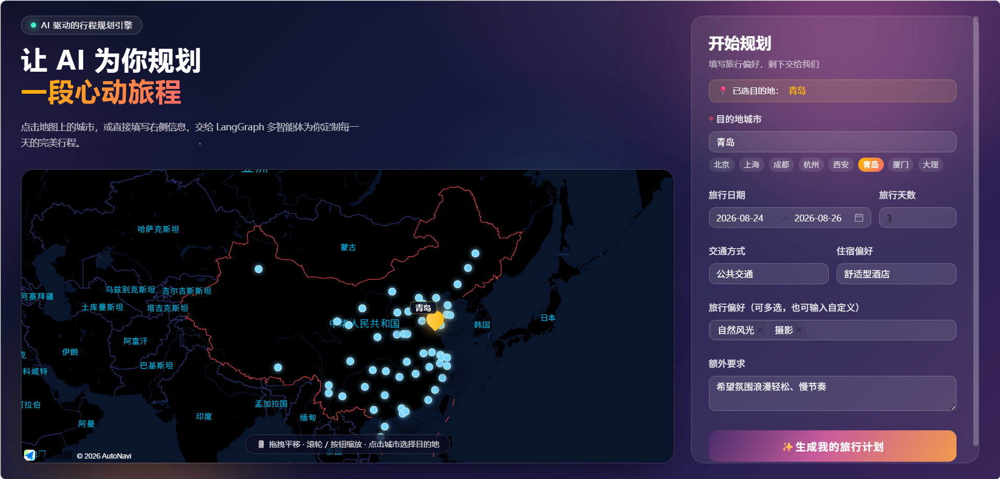
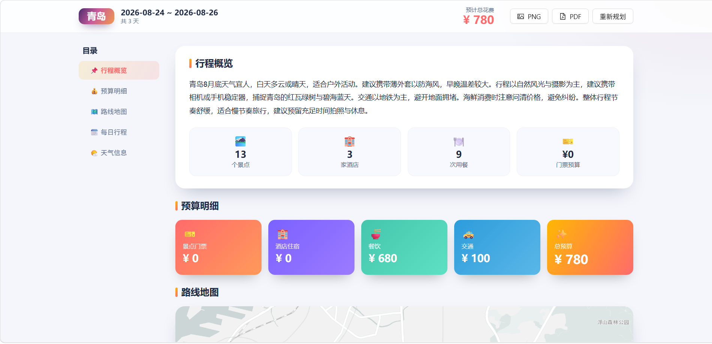
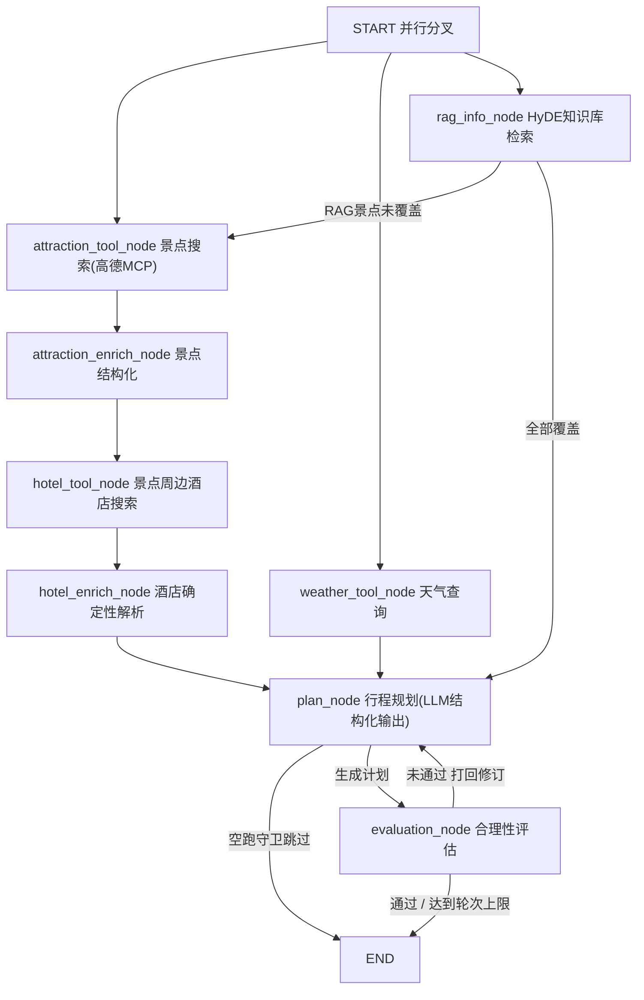

# 🧳 Travel-agents · 智能旅行助手
基于 **LangGraph 多智能体工作流** 的 AI 旅行规划系统：用户输入城市、日期与偏好后，Agent 并行调用高德地图 MCP 工具与本地 RAG 知识库，获取真实景点 / 酒店 / 天气数据，经"规划 → 评估 → 反思修订"循环生成包含每日行程、餐饮、住宿、预算的完整旅行计划，并通过 SSE 实时推送各节点进度。
| 首页表单 | 规划结果 |
| :---: | :---: |
|  |  |
## ✨ 功能特性
- **多源并行检索**：景点搜索、天气查询、RAG 知识库检索三路并行，景点详情并发拉取（信号量限流 + 自动重试）
- **HyDE 知识库检索**：LLM 先生成假设性答案文档再做向量检索，命中攻略类语料；检索出的必玩景点未覆盖时自动触发**补搜循环**
- **真实数据锚点选酒店**：以景点坐标为锚点做周边 3km 酒店搜索，Haversine 公式计算"距景点约 X km"
- **评估反思循环**：评估节点做"确定性硬校验（天数 / 时长 / 路线衔接）+ LLM 合理性评估"，不合格打回规划节点修订，最多 2 轮
- **防幻觉设计**：LLM 只输出计划框架（名称引用），景点 / 酒店 / 天气 / 日期等详情由系统按名称确定性回填
- **SSE 实时进度**：基于 `astream_events` 推送节点级进度，含心跳保活与断连自动取消
- **行程导出**：前端支持导出 PDF / PNG
## 🏗 系统架构

**关键设计**：
- 多入边节点采用 ANY 触发 + **状态守卫**（数据就绪检查、`search_round` / `hotel_round` 轮次对齐），避免中间态提前规划
- 状态字段使用自定义 **reducer**（set 并集 / list 累积）支持多轮补搜数据叠加
- 关键节点配置 `RetryPolicy` 应对 LLM 偶发失败
## 🛠 技术栈
| 层 | 技术 |
|---|---|
| Agent 编排 | LangGraph 1.x、LangChain 1.x |
| 大模型 | 阿里云 DashScope 通义千问（OpenAI 兼容接口） |
| 工具接入 | 高德地图 MCP（SSE 传输，15 个工具） |
| RAG | SQLite-vec、HyDE、text-embedding-v4 |
| 后端 | FastAPI、Uvicorn、SSE |
| 前端 | Vue 3、Vite、TypeScript、Ant Design Vue、高德地图 JS API、jspdf / html2canvas |
| 可观测 | LangSmith 追踪（可选） |
## 🚀 快速开始
### 环境要求
- Python ≥ 3.11（开发环境 3.13）
- Node.js ≥ 18
- 高德开放平台 API Key、阿里云百炼（DashScope）API Key
### 1. 克隆项目并安装后端依赖
```bash
git clone https://github.com/sheepsheep678/travel_agents.git
cd travel_agents
python -m venv .venv
# Windows
.venv\Scripts\activate
# macOS / Linux
# source .venv/bin/activate
pip install -r requirements.txt
```
### 2. 配置环境变量
在项目根目录创建 `.env`，按下表填写：
| 变量 | 说明 |
|---|---|
| `HOST` / `PORT` | 服务监听地址与端口，默认 `0.0.0.0` / `8000` |
| `LOG_LEVEL` | 日志级别，默认 `INFO` |
| `CORS_ORIGINS` | 允许的跨域来源，逗号分隔 |
| `OPENAI_API_KEY` | DashScope API Key（OpenAI 兼容模式） |
| `OPENAI_BASE_URL` | `https://dashscope.aliyuncs.com/compatible-mode/v1` |
| `OPENAI_MODEL_ID` | 模型 ID，如 `qwen3.7-flash` |
| `OPENAI_TIMEOUT` | LLM 请求超时（秒），建议 `120` |
| `EMBEDDING_MODEL_NAME` | 向量模型，默认 `text-embedding-v4` |
| `AMAP_API_KEY` | 高德开放平台 Key（后端 MCP 使用） |
| `VITE_AMAP_WEB_JS_KEY` | 高德 JS API Key，**写入 `frontend/.env`** |
| `UNSPLASH_ACCESS_KEY` / `UNSPLASH_SECRET_KEY` | Unsplash 图片服务（可选） |
| `LANGSMITH_TRACING` / `LANGSMITH_API_KEY` | LangSmith 追踪（可选） |
`.env` 模板：
```dotenv
HOST=0.0.0.0
PORT=8000
LOG_LEVEL=INFO
CORS_ORIGINS=http://localhost:5173,http://localhost:3000
OPENAI_API_KEY=sk-xxxx
OPENAI_BASE_URL=https://dashscope.aliyuncs.com/compatible-mode/v1
OPENAI_MODEL_ID=qwen3.7-flash
OPENAI_TIMEOUT=120
EMBEDDING_MODEL_NAME=text-embedding-v4
AMAP_API_KEY=xxxx
UNSPLASH_ACCESS_KEY=
UNSPLASH_SECRET_KEY=
LANGSMITH_TRACING=false
LANGSMITH_API_KEY=
```
> ⚠️ **常见坑**：`backend/app/services/config.py` 中的 `db_path` / `md5_path` 是向量库**绝对路径**，克隆后请改成你本机的实际路径，否则 RAG 检索与知识库上传都会失败。
### 3. 启动后端（项目根目录执行）
```bash
uvicorn backend.app.api.main:app
```
启动时会自动连接高德 MCP 并加载 15 个工具，默认监听 `8000` 端口。加 `--reload` 可热重载。
### 4. 启动前端
```bash
cd frontend
npm install
npm run dev
```
访问 `http://localhost:5173` 即可使用。
## 🔌 API 说明
| 方法 | 路径 | 说明 |
|---|---|---|
| GET | `/api/health` | 健康检查（含 MCP 就绪状态） |
| POST | `/api/trip/plan` | 一次性生成旅行计划 |
| POST | `/api/trip/plan/stream` | SSE 流式生成，实时推送节点进度 |
**请求体示例**：
```json
{
  "city": "青岛",
  "start_date": "2026-08-20",
  "end_date": "2026-08-22",
  "travel_days": 3,
  "transportation": "自驾",
  "accommodation": "酒店",
  "preferences": ["风景", "啤酒"],
  "free_text_input": "希望旅行氛围浪漫、轻松、慢节奏"
}
```
**SSE 事件协议**：
```jsonc
{"type": "node_start", "node": "weather_tool_node", "label": "正在查询天气..."}
{"type": "node_end",   "node": "weather_tool_node", "payload": {"weather_count": 4}}
{"type": "node_error", "node": "plan_node", "message": "...", "retry": true}
{"type": "done", "success": true, "message": "生成成功", "data": {"...": "TripPlan"}}
```
## 📚 RAG 知识库
城市攻略语料位于 `backend/app/api/data/*.txt`，向量化后存入 `vec.db`（表名 `knowledge_base`）。新增或更新语料后重建向量库：
```bash
# 在项目根目录执行；脚本默认扫描当前工作目录下的 data 目录，
# 如路径不符，可将脚本末尾 build_from_dir() 的参数改为 "backend/app/api/data"
python -m backend.app.api.rag_file_uploader
```
上传脚本按文件 MD5 去重，已入库文件自动跳过；切分策略为 500 字符 / 50 字符重叠，按中文标点优先断句。
## 📁 项目结构
```
travel_agents/
├── backend/app/
│   ├── api/
│   │   ├── data/                  # 城市攻略语料（txt）
│   │   ├── main.py                # FastAPI 入口（健康检查/规划/流式规划）
│   │   ├── rag_file_uploader.py   # 知识库向量化上传脚本
│   │   └── vec.db                 # SQLite-vec 向量库
│   ├── models/
│   │   ├── request.py             # TripRequest
│   │   └── response.py            # TripPlan / Attraction / Hotel 等
│   ├── nodes/
│   │   ├── llm.py                 # LLM / Embedding 单例
│   │   └── tools/
│   │       └── amap_mcp_servers.py    # 高德 MCP 客户端（SSE）
│   └── services/
│       ├── config.py              # pydantic-settings 配置
│       ├── rag_component.py       # SQLite-vec 异步检索
│       └── travel_plan_agent.py   # LangGraph 图定义（核心）
├── frontend/                      # Vue3 + Vite 前端
│   └── src/
│       ├── views/                 # Home / Result 页面
│       ├── services/api.ts        # 后端接口与 SSE 消费
│       └── data/cities.ts         # 城市选项
├── pic/                           # README 截图
├── requirements.txt
└── .env
```
## 🙏 致谢
- [LangGraph](https://github.com/langchain-ai/langgraph) — 多智能体编排框架
- [高德开放平台](https://lbs.amap.com/) — 地图与 MCP 服务
- [阿里云百炼](https://bailian.console.aliyun.com/) — 通义千问模型服务
